# A Compact Structure-Aware and Symmetry-Breaking MILP for Flexible Job-Shop Scheduling with AGVs

## Project Overview

This repository contains the implementation of a compact and structure-aware Mixed-Integer Linear Programming (MILP) formulation for the Flexible Job-Shop Scheduling Problem with finite Automated Guided Vehicles (FJSP-AGVs). The proposed model significantly reduces the number of decision variables while preserving key precedence and resource-coupling relationships. By exploiting the triangle inequality of transportation distances, breaking AGV assignment symmetry, and incorporating problem-specific lower bounds, this work substantially enhances the efficiency of exact optimization using commercial solvers.

## Key Features

- **Compact MILP Formulation**: A sequence-based model with significantly fewer sequencing-related variables compared to existing approaches.
- **Structural Property Exploitation**: Derives and enforces a key property—the first transportation task of each AGV must correspond to the first operation of some job—using the triangle inequality of transportation distances.
- **Symmetry Breaking**: Introduces constraints to eliminate redundant AGV assignment permutations, reducing the search space.
- **Effective Lower Bounds**: Three problem-specific lower bounds are designed to strengthen the linear relaxation and improve branch-and-bound pruning.
- **Comprehensive Benchmarking**: Validated on five classic benchmark sets (FJSPT, EX, SFJS, MFJSP, and MK) with 97 instances, demonstrating improved makespan values and significantly reduced computational time.

## Project Structure

```text
fjsp_agv_milp/
├── FJSPT_model_all.py  # Main MILP model implementation with Gurobi
├── FJSPT_model_yao.py  # Baseline MILP model (Yao et al. 2025) for comparison
├── read_data.py        # Reads benchmark instances (.dat files)
├── lower_bound.py      # Computes the three proposed lower bounds (lb1, lb2, lb3)
├── record_result.py    # Writes optimization results to CSV
├── show_solution.py    # Visualizes the schedule with Gantt charts
├── gantt.py            # Visualizes the schedule with Gantt charts
├── benchmark/          # Directory containing benchmark instances
│ ├── FJSPT/            # FJSPT benchmark (10 instances)
│ ├── EX/               # EX benchmark (57 instances)
│ ├── SFJS/             # SFJS benchmark (10 instances)
│ ├── MFJS/             # MFJS benchmark (10 instances)
│ ├── MK/               # MK benchmark (10 instances)
│ ├── case_study/       # Real-world cases within a Chinese coal machine structural parts production workshop.
└── result/             # Output directory for logs and solutions
```
The baseline model from [Yao et al. (2025)](https://doi.org/10.1109/TASE.2024.3356255) is provided in `FJSPT_model_yao.py` for direct performance comparison.

## Prerequisites

- **Python**: 3.9 or higher
- **Gurobi**: 10.0.1 or later (with a valid license)
- **NumPy**: 1.26.4
- **Matplotlib**: 3.6.1 (for Gantt chart visualization)

## Usage

1. **Prepare benchmark data**: Place the instance files (`.dat` format) in the corresponding `benchmark/` subdirectories.

2. **Run the MILP solver**:

   ```bash
   python FJSPT_model_all.py
   ```
## Citation
If you find this code or the associated research useful for your work, please cite our paper.

## Optimal Gantt Charts

For all instances where the proposed model achieved the optimal makespan (Gap = 0), the corresponding Gantt charts are provided below. The charts illustrate machine assignments and AGV transportation schedules.

*Note: The Gantt charts are automatically generated by show_solution.py. All below instances were solved to optimality (Gap = 0).*

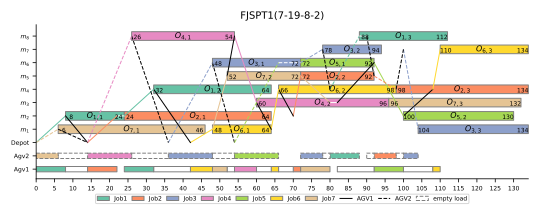
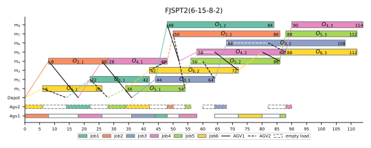
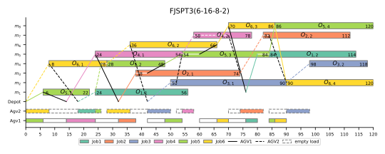
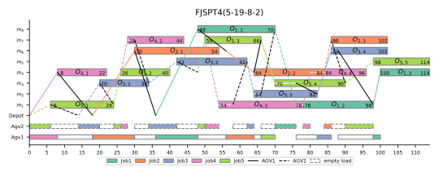
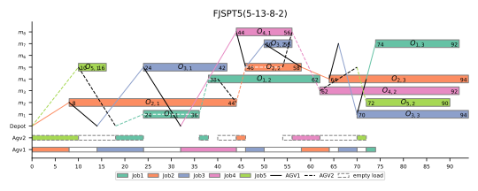
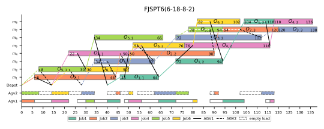
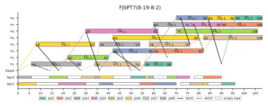
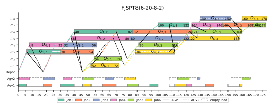
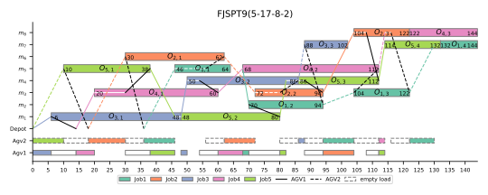
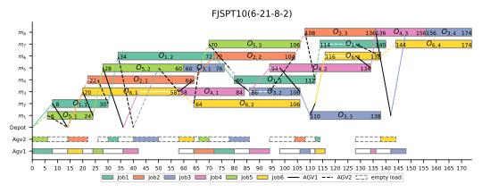
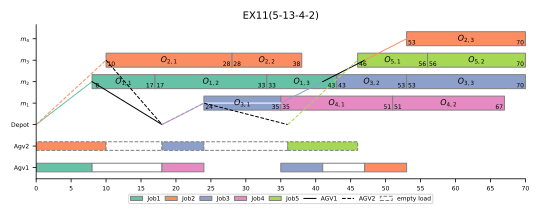
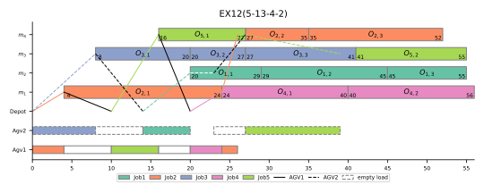
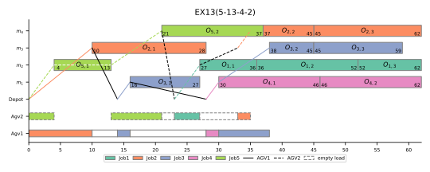
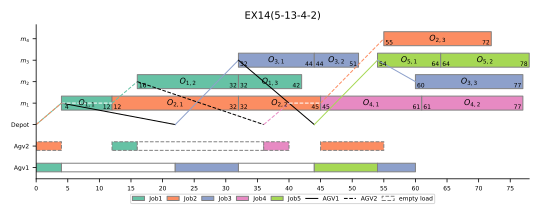
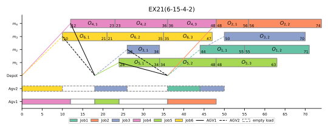
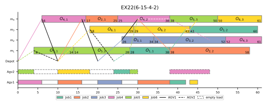
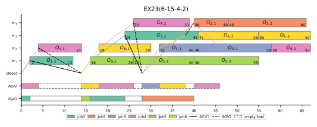
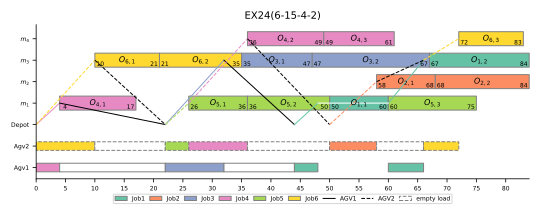
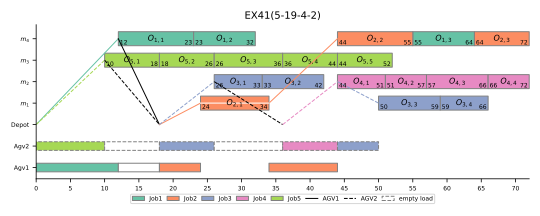
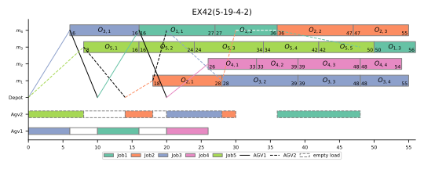
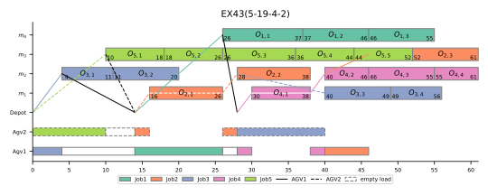
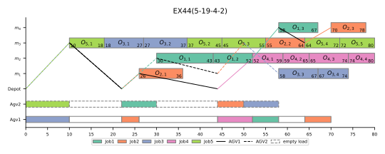
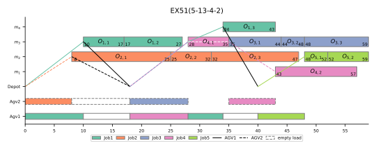
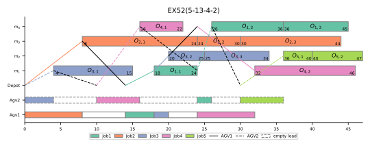
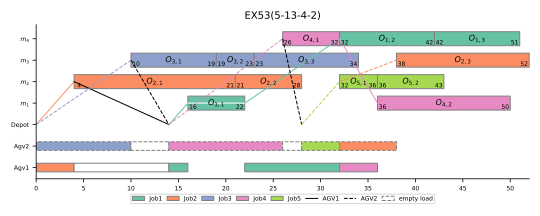
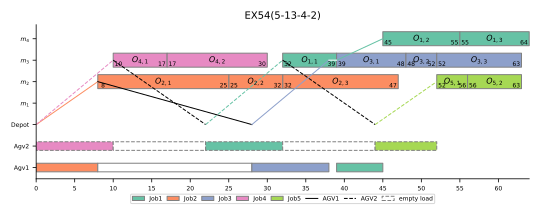
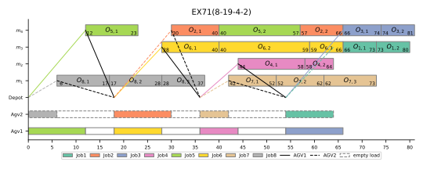
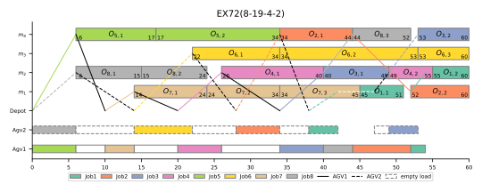
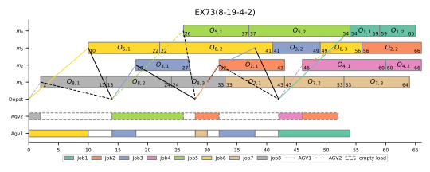
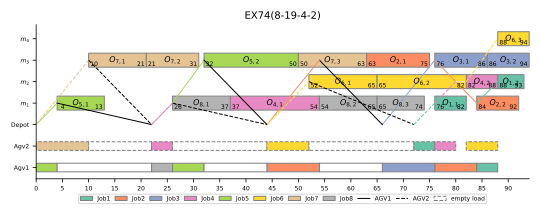
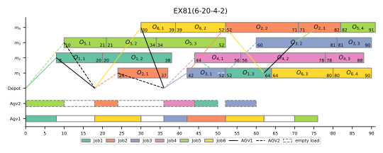
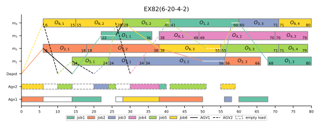
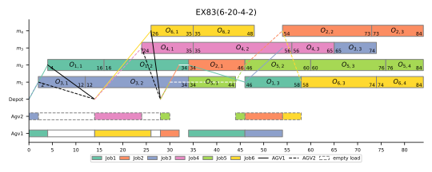
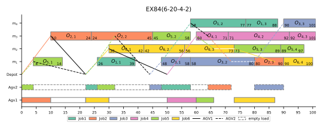
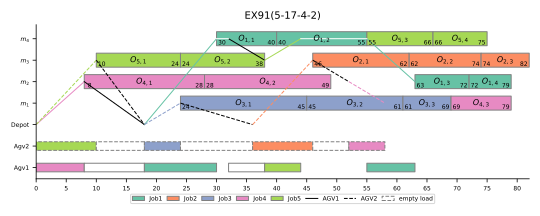
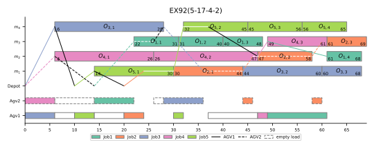
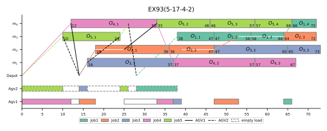
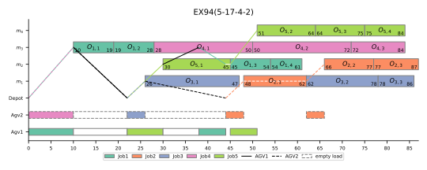
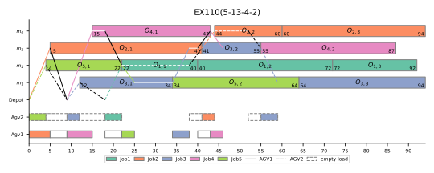
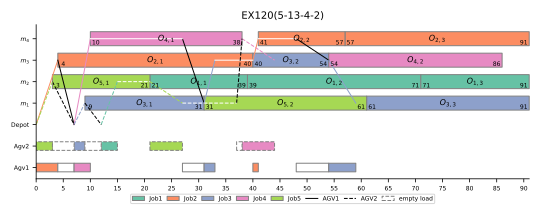
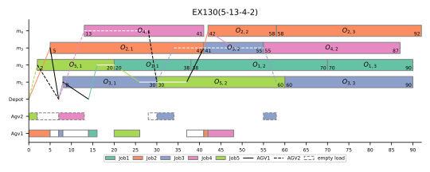
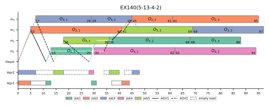
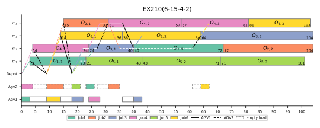
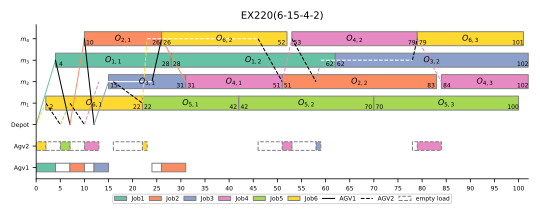
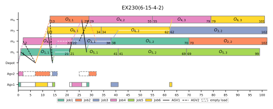
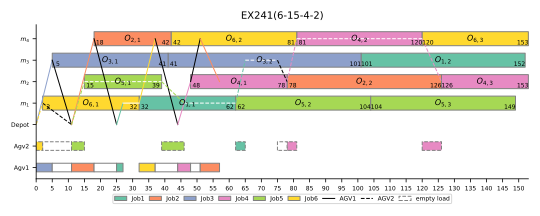
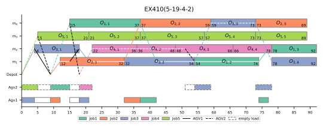
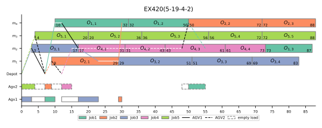
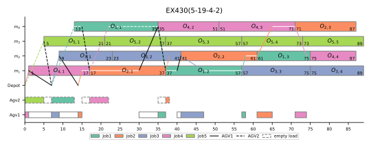
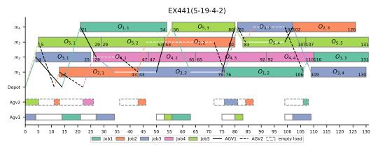


